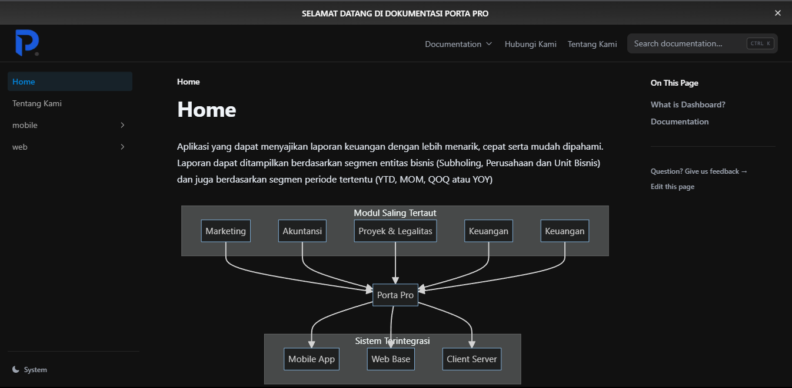

# Porta Pro Documentation

This is a template for creating documentation with [Nextra](https://nextra.site/docs).

## Deylopment

**Development**
[**Live Demo →**](https://dev.help.portapro.co.id/)

**Production**
[**Live Demo →**](https://help.portapro.co.id/)

[]

## Quick Start

Click the button to clone this repository and deploy it on Vercel:

First, run `pnpm i` to install the dependencies.

Then, run `pnpm dev` to start the development server and visit localhost:3000.

## License

This project is licensed under the MIT License.
