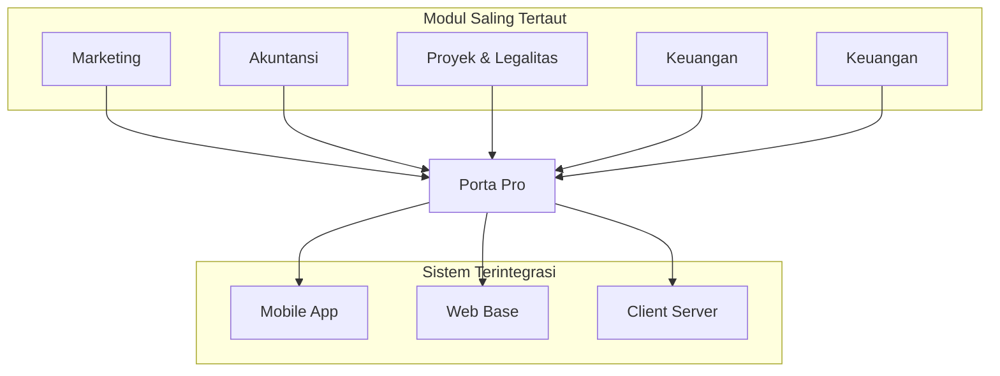

# Porta Pro Web Apps

```mermaid
graph TD;
subgraph AA [Modul Saling Tertaut]
A[Marketing];
B[Akuntansi];
C[Proyek & Legalitas];
D[Keuangan];
H[Keuangan];
end
subgraph BB [Sistem Terintegrasi]
E[Mobile App];
F[Web Base];
G[Client Server];
end
Z[Porta Pro];
A --> Z;
B --> Z;
C --> Z;
D --> Z;
H --> Z;
Z --> E;
Z --> F;
Z --> G;
```

